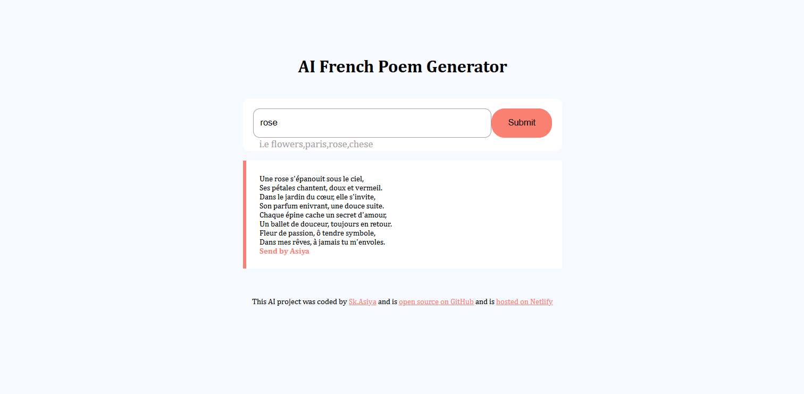

# 🤖 AI French Poem Generator

Generate beautiful French poems instantly using AI. Simply enter a topic like **Friendship**, **Love**, **Nature**, or **Paris**, and receive a unique French poem in seconds.

---

## 🚀 Live Demo

🔗 **https://frenchpoemgeneratai.netlify.app/**

---

## 📸 Preview

<p align="center">
  
</p>

---

## ✨ Features

- 🤖 AI-generated French poems
- ✍️ Generate poems from any topic
- ⚡ Fast and responsive interface
- 🎨 Clean and modern UI
- 📱 Mobile-friendly design
- 🌐 Hosted on Netlify

---

## 🛠️ Tech Stack

- HTML5
- CSS3
- JavaScript (ES6)
- AI API

---

## 📂 Project Structure

```text
french-poem-generator/
│── src/
│── french-poem-generator.png
│── index.html
└── README.md
```

---

## ⚙️ Getting Started

### Clone the repository

```bash
git clone https://github.com/asiya2123/french-poem-generator.git
```

### Navigate to the project directory

```bash
cd french-poem-generator
```

### Open the project

Simply open **index.html** in your browser.

---

## 🎯 Future Improvements

- 🌍 Support multiple languages
- 📋 Copy poem to clipboard
- 📥 Download generated poems
- 🎭 Multiple poem styles (Romantic, Nature, Friendship, etc.)
- 💾 Save generated poems
- 🌙 Dark Mode

---

## 📬 Connect With Me

**👩‍💻 Asiya Shaik**

- 🏗️ GitHub: https://github.com/asiya2123
- 💼 LinkedIn: https://www.linkedin.com/in/shaik-asiya786

---

## ⭐ Support

If you found this project helpful,

⭐ Star this repository

🍴 Fork this repository

💡 Share your feedback

---

<p align="center">
Made with ❤️ by <strong>Asiya Shaik</strong>
</p>
